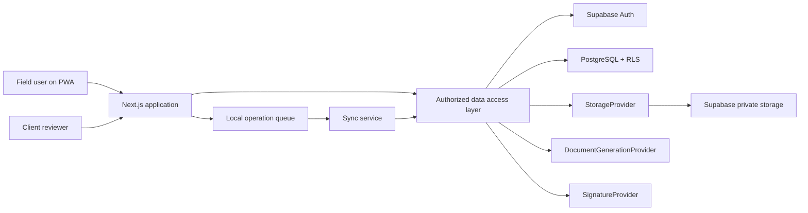

# VORTECH Quality architecture

## Repository diagnosis

The `iJesusF/Quality` repository was empty on 2026-08-10: there was no application, Supabase project, authentication flow, database schema or reusable UI. This removes integration constraints for Phase 1, but it also means no existing `vortech.mx/admin` behavior or customer data can be assumed. The Quality bounded context is therefore implemented independently and exposes explicit integration boundaries for a future VORTECH admin system.

## Architecture goals

1. Preserve traceability from a physical segment to every inspection, material lot, document revision, signature and audit event.
2. Keep contractual records deterministic and immutable after approval.
3. Keep authorization close to the data through Supabase RLS and a server-side data access layer.
4. Support field work with touch-first responsive UI and a staged offline model.
5. Let storage, PDF and signature vendors change behind interfaces.

## System context



## Application layers

| Layer | Responsibility | Examples |
| --- | --- | --- |
| Presentation | Routes, accessible controls, responsive layouts and states | `src/app`, `src/components` |
| Application | Use cases, DTOs, permission checks and orchestration | `src/features/*/application` |
| Domain | Entities, value objects, invariants and state transitions | `src/features/*/domain` |
| Persistence | Supabase repositories and query mapping | `src/features/*/infrastructure` |
| External services | Storage, document and signature adapters | `src/lib/providers` |

Server Components perform initial reads and pass small serializable DTOs to client islands. Client Components are limited to browser APIs and interaction: sidebar state, search, offline status, service worker registration and forms. Secrets stay in server-only modules.

## Runtime modes

- **Supabase mode:** enabled when both public Supabase variables exist. Authentication, membership and project data are real; RLS is authoritative.
- **Setup mode:** when variables are absent, the app exposes only setup instructions. It never fabricates project data or bypasses authentication.

## Folder structure

```text
src/
  app/
    (auth)/login/
    (quality)/
      dashboard/
      projects/
      drawings/
      segments/
      inspections/
      materials/
      issues/
      reports/
      documents/
      turnover/
      settings/
  components/
    layout/
    ui/
  features/
    auth/
    dashboard/
    projects/
  lib/
    supabase/
    permissions/
    providers/
supabase/
  migrations/
  seed.sql
docs/
  adr/
```

Only Phase 1 routes are fully interactive. Later routes use honest, explicit empty states rather than fake workflows.

## Route map

| Route | Phase | Purpose |
| --- | --- | --- |
| `/login` | 1 | Supabase email/password sign-in |
| `/` | 1 | Redirect to the quality dashboard |
| `/dashboard` | 1 | Project KPIs, quality progress, activity and actions |
| `/projects` | 1 | Authorized project portfolio |
| `/projects/[projectId]` | 1 | Project summary and configuration entry point |
| `/drawings` | 2 | Drawing library and revisions |
| `/drawings/[drawingId]` | 2 | Drawing viewer and data-backed markup |
| `/segments/[segmentId]` | 2 | Complete segment dossier |
| `/inspections/new` | 3 | Start an inspection |
| `/inspections/[inspectionId]` | 3 | Dynamic form, evidence and completion |
| `/materials` | 5 | Receipts and material traceability |
| `/issues` | 6 | NCR and Punch management |
| `/reports/[reportId]` | 3/4/7 | Preview, revision and signature workflow |
| `/documents/templates` | 4 | Immutable template manager |
| `/turnover` | 9 | Dossier completeness and package generation |
| `/settings/project` | 1+ | Project units, timezone, naming and quality rules |
| `/sync` | 8 | Offline queue, retry and conflict center |

## External provider contracts

```ts
interface StorageProvider {
  put(input: UploadInput): Promise<StoredObject>;
  createReadUrl(key: string, expiresInSeconds: number): Promise<string>;
  copy(sourceKey: string, destinationKey: string): Promise<void>;
}

interface DocumentGenerationProvider {
  generate(input: GenerationInput): Promise<GeneratedArtifact>;
}

interface SignatureProvider {
  createEnvelope(input: EnvelopeInput): Promise<EnvelopeReference>;
  send(envelopeId: string): Promise<void>;
  getStatus(envelopeId: string): Promise<EnvelopeStatus>;
  downloadSignedDocument(envelopeId: string): Promise<Uint8Array>;
}
```

## Security boundary

- `auth.users` owns identity; `user_profiles` owns application profile data.
- Organization and project membership are separate. Project membership controls project records.
- Server actions and route handlers re-check authorization; the UI is never the security boundary.
- Private files use project-prefixed object keys and short-lived signed URLs.
- The browser receives only publishable Supabase credentials. `service_role` is server-only.
- Approved documents store their template revision, input snapshot and SHA-256 checksum.
- Soft deletion is used for contractual and traceability records.

## Dependencies

| Dependency | Decision |
| --- | --- |
| Next.js 16 / React 19 | App Router, Server Components, metadata and deployment on Vercel |
| TypeScript 5 | Strict domain and DTO contracts |
| Tailwind CSS 4 | Responsive design tokens and utility composition |
| Supabase JS + SSR | Auth, PostgreSQL, RLS and cookie-safe server sessions |
| Zod 4 | Server-side input and environment validation |
| Lucide React | One consistent icon language |
| Vitest + Testing Library | Domain, component and accessibility-oriented tests |
| `clsx` + `tailwind-merge` | Predictable reusable component classes |

Dependencies for later phases are deliberately deferred until their adapter is implemented: PDF/Office processing, QR scanning, IndexedDB sync and DocuSign.
