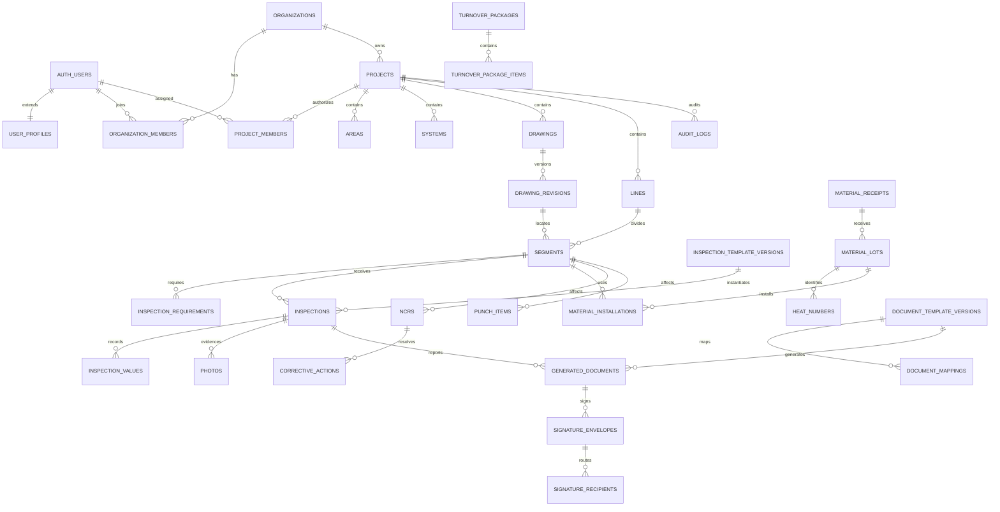

# Database model

## Ownership model

Supabase `auth.users` is the identity source. `user_profiles` extends identity, `organization_members` grants organization access and `project_members` grants project access. All quality records are project-scoped, even when a relation could infer the project, because explicit `project_id` makes RLS, partitioning and audit queries safer and faster.

## Entity relationship model



## Relational versus JSONB

Relational columns hold project ownership, revisions, traceability links, roles, statuses, timestamps and document identities. JSONB is limited to flexible schemas and snapshots:

- inspection form schema and configurable validation rules;
- field values that retain a relational inspection/field key;
- drawing geometry;
- project/customer configuration;
- immutable generation input snapshots and provider metadata.

## Important invariants

- A drawing revision is unique by drawing and revision code; only one can be active.
- Template source objects are immutable. A revision creates a new row and storage key.
- An inspection stores the exact template version and applicable procedure.
- Material installation links a material lot/heat to a segment with quantity and unit.
- Folios are allocated atomically through `next_project_folio`, never with `max()+1`.
- Audit logs cannot be updated or deleted through normal application roles.
- Final documents store a checksum and cannot be silently overwritten.

## RLS strategy

`is_organization_member`, `is_project_member` and `has_project_role` are `security definer` helper functions with a locked search path. Select access requires project membership. Mutations require one of the configured operational roles and are tightened by use-case checks for transitions such as approval. Client reviewer and read-only roles never receive general mutation policies.

Storage policies will mirror the database path convention:

```text
private/{project_id}/{entity_type}/{entity_id}/{revision}/{filename}
```

The migration in `supabase/migrations/202608100001_initial_quality_schema.sql` is the executable source of truth.

## Hosted migration runbook

The numbered SQL files are cumulative migrations, not complete schema snapshots. Apply each file exactly once and in filename order. The Supabase SQL Editor does not infer which repository files have already run.

Before applying migrations to a hosted database, verify whether the baseline exists without modifying data:

```sql
select to_regclass('public.user_profiles') as user_profiles,
       to_regclass('public.projects') as projects,
       to_regprocedure('public.bootstrap_quality_workspace(text,text,text,text)') as workspace_function;
```

If `user_profiles` and `projects` are non-null, migration `202608100001_initial_quality_schema.sql` is already present and must not be run again. Apply only `202608100002_recover_workspace_onboarding.sql` followed by `202608100003_operational_backend.sql`. Error `42P07` from an attempted baseline rerun is harmless because the baseline is wrapped in `begin`/`commit`; discard that failed query and continue with the pending incremental files. Do not drop existing tables.

After applying the incremental migrations, verify the operational backend:

```sql
select to_regprocedure('public.create_quality_inspection(uuid,text,uuid)') as inspection_function;
select id, public, file_size_limit from storage.buckets where id = 'quality-private';
```

The function and bucket should each be present. Migration `202608100003_operational_backend.sql` explicitly replaces its named policies and triggers, so it can be retried safely if SQL Editor disconnects before showing the result.
