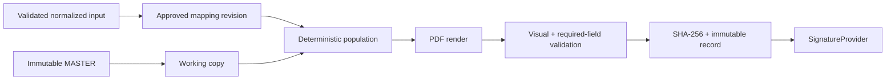

# Deterministic document generation

Original Excel/PPTX files are private, immutable storage objects. Every generation records the source object checksum, template version, mapping version, normalized input snapshot, generator version and output checksum. Final generation is never LLM-driven.

The first Haskell file must be inspected before any write: sheets/slides, shapes/cells, merged cells, print areas, fields, signatures and rendering are inventoried. The test output is always a copy and is visually compared with the master.
